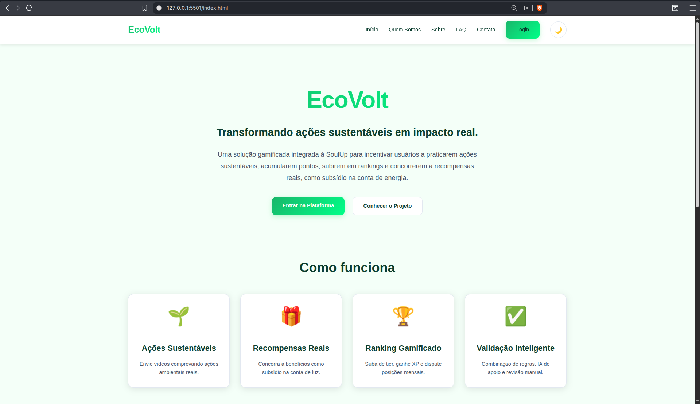
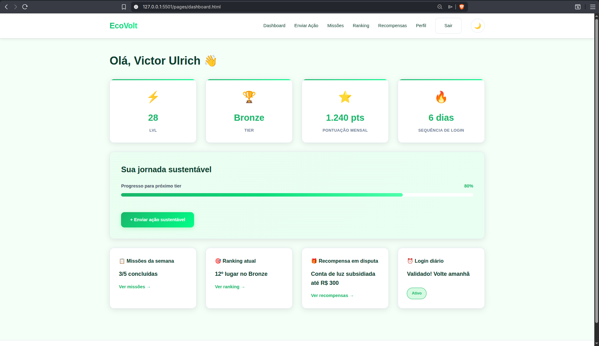
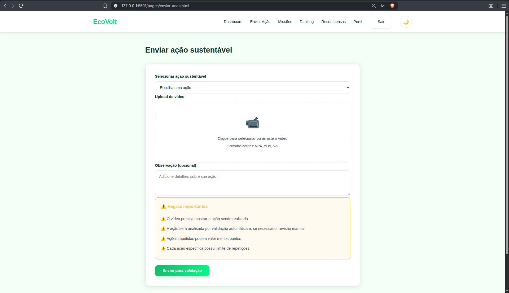
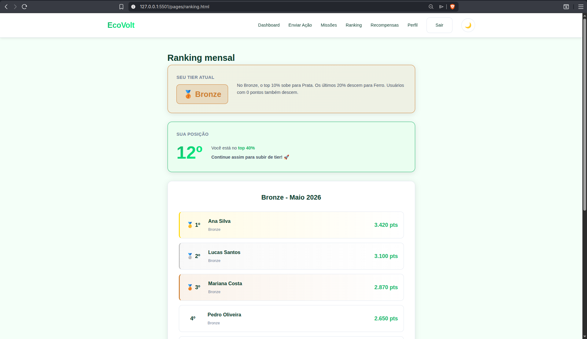
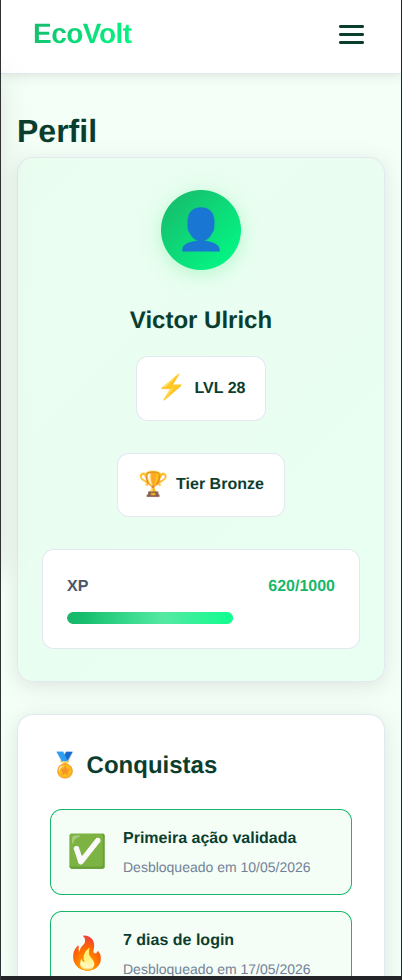

# ⚡ EcoVolt — Transformando ações sustentáveis em impacto real

> Plataforma gamificada desenvolvida como parte do **FIAP Challenge SoulUp 2026**, com o objetivo de incentivar usuários a praticarem ações sustentáveis reais, acumularem pontos, subirem em rankings mensais e concorrerem a recompensas concretas, como subsídio na conta de energia.

---

## Sumário

- [Visão Geral](#visão-geral)
- [Contexto e Problema](#contexto-e-problema)
- [Solução Proposta](#solução-proposta)
- [Funcionalidades](#funcionalidades)
- [Mecânica de Gamificação](#mecânica-de-gamificação)
- [Sistema de Validação](#sistema-de-validação)
- [Tecnologias Utilizadas](#tecnologias-utilizadas)
- [Entregas Técnicas Relacionadas](#entregas-técnicas-relacionadas)
- [Estrutura do Projeto](#estrutura-do-projeto)
- [Páginas da Aplicação](#páginas-da-aplicação)
- [Como Executar](#como-executar)
- [Credenciais de Teste](#credenciais-de-teste)
- [Prévia Visual do Projeto](#prévia-visual-do-projeto)
- [Roadmap](#roadmap)
- [Repositório](#repositório)
- [Equipe](#equipe)
- [Contato](#contato)
- [Licença](#licença)

---

## Visão Geral

O **EcoVolt** é uma solução web gamificada integrada à proposta da plataforma **SoulUp**, com foco no aumento do engajamento contínuo dos usuários em ações sustentáveis.

A aplicação combina **gamificação**, **validação de evidências**, **missões semanais**, **ranking mensal**, **tiers**, **XP**, **conquistas** e **recompensas reais** para transformar ações ambientais em impacto socioambiental mensurável.

Este repositório contém principalmente a entrega de **Front-End** do projeto EcoVolt, desenvolvida com tecnologias web nativas: **HTML5**, **CSS3** e **JavaScript**, incluindo design responsivo, tema claro/escuro e telas navegáveis do fluxo de uso.

---

## Contexto e Problema

A SoulUp identificou a necessidade de aumentar o **engajamento recorrente** dos usuários em práticas sustentáveis, indo além de campanhas pontuais.

O desafio é manter o usuário ativo, recompensando comportamentos reais e mensuráveis, sem abrir margem para fraudes, ações artificiais ou interações sem impacto.

**Principais dores endereçadas:**

- Baixa retenção em iniciativas sustentáveis tradicionais;
- Falta de validação confiável das ações realizadas;
- Ausência de recompensas concretas ligadas ao impacto gerado;
- Dificuldade em gerar comunidade e disputa saudável entre usuários;
- Necessidade de transformar ações sustentáveis em uma experiência contínua e motivadora.

---

## Solução Proposta

O EcoVolt resolve esses pontos por meio de uma **plataforma gamificada com validação híbrida**.

Fluxo principal da solução:

1. O usuário acessa a plataforma e realiza login.
2. Escolhe uma ação sustentável dentro do catálogo.
3. Envia um **vídeo comprobatório** da ação realizada.
4. O sistema valida a ação combinando regras determinísticas, análise contextual, apoio de IA e revisão manual quando necessário.
5. O usuário recebe **pontos**, **XP** e progresso em missões.
6. A pontuação influencia o **ranking mensal** e a evolução entre **tiers**.
7. Os melhores colocados concorrem a **recompensas reais**, incluindo subsídio na conta de energia.

---

## Funcionalidades

### Para o usuário

- ✅ Login simulado com usuários de teste;
- ✅ Dashboard personalizado com nome do usuário logado;
- ✅ Visualização de pontos, XP, nível, tier e sequência de login;
- ✅ Envio de ações sustentáveis com upload de vídeo;
- ✅ Associação das ações aos Objetivos de Desenvolvimento Sustentável (ODS);
- ✅ Acompanhamento dos envios: em análise, aprovado, recusado ou em revisão;
- ✅ Solicitação de revisão manual para envios recusados;
- ✅ Missões semanais divididas por dificuldade;
- ✅ Ranking mensal por tier;
- ✅ Página de recompensas;
- ✅ Perfil do usuário com conquistas e estatísticas;
- ✅ FAQ com perguntas frequentes;
- ✅ Formulário de contato;
- ✅ Modo claro e escuro com persistência via `localStorage`;
- ✅ Layout responsivo para desktop, tablet e mobile.

### Para apresentação institucional

- 📄 Página inicial com apresentação do projeto;
- 📄 Página Sobre com contexto, solução, tecnologias e roadmap;
- 👥 Página Quem Somos com dados dos integrantes;
- ❓ Página FAQ;
- 📬 Página de Contato;
- 🧩 Páginas internas demonstrando o funcionamento da solução.

---

## Mecânica de Gamificação

### Pontuação

Cada ação sustentável possui uma pontuação de **0 a 100 pontos**, definida com base em critérios como:

- impacto ambiental estimado;
- esforço necessário;
- frequência recomendada;
- categoria da ação;
- relação com os ODS.

Ações repetidas podem sofrer redução progressiva de pontos, evitando comportamento de spam ou tentativa de farm.

### Tiers

Os usuários evoluem mensalmente dentro de tiers competitivos:

1. 🔩 **Ferro**
2. 🥉 **Bronze**
3. 🥈 **Prata**
4. 🥇 **Ouro**
5. 💎 **Diamante**
6. 🌱 **Sustentabilístico**

A progressão considera o desempenho mensal do usuário no ranking, levando em conta ações validadas, missões, interações relevantes e consistência de acesso.

### Missões

As missões incentivam o usuário a manter frequência e diversidade nas ações sustentáveis.

Exemplos:

- 🟢 **Fáceis** — realizar login diário, interagir com conteúdos e acessar a plataforma;
- 🟡 **Médias** — enviar ações sustentáveis e participar de atividades da comunidade;
- 🔴 **Difíceis** — completar desafios semanais com maior impacto ambiental.

### Recompensas

As recompensas simuladas no projeto incluem:

- 💡 Conta de luz subsidiada;
- 🌟 Selos e conquistas;
- 🎫 Cupons de parceiros sustentáveis;
- 🖼️ Molduras especiais de perfil;
- 🏆 Troféus de desempenho;
- ⚡ Bônus de XP.

---

## Sistema de Validação

A validação dos envios segue um modelo híbrido para garantir confiabilidade e reduzir fraudes.

| Etapa | Descrição |
|------|-----------|
| **1. Regras determinísticas** | Verificação de dados do envio, categoria escolhida, limites da ação e histórico do usuário |
| **2. Análise contextual** | Avaliação da coerência entre o vídeo enviado e a ação sustentável selecionada |
| **3. Apoio de IA** | Apoio à identificação de inconsistências, repetições ou evidências suspeitas |
| **4. Revisão manual** | Casos ambíguos ou contestados podem ser avaliados por um responsável humano |
| **5. Recurso do usuário** | O usuário pode solicitar revisão caso discorde de uma recusa |

> A IA é tratada como uma camada de apoio ao processo de validação, não como a solução inteira.

---

## Tecnologias Utilizadas

O projeto EcoVolt foi desenvolvido de forma multidisciplinar, contemplando entregas de Front-End Design Engineering, Computational Thinking Using Python, Java, Banco de Dados e Chatbot.

| Área / Disciplina | Tecnologia / Ferramenta | Aplicação no Projeto |
|-------------------|--------------------------|----------------------|
| Front-End | **HTML5** | Estruturação semântica das páginas da aplicação |
| Front-End | **CSS3** | Estilização, responsividade, animações, layout e modo claro/escuro |
| Front-End | **JavaScript Vanilla** | Interatividade, menu responsivo, validação de formulários, login simulado, troca de tema e manipulação do `localStorage` |
| Armazenamento Local | **localStorage** | Simulação de sessão do usuário e persistência do tema escolhido |
| Chatbot | **IBM Watson Assistant** | Criação do chatbot do EcoVolt, com intenções, entidades e fluxos de conversa voltados ao suporte do usuário |
| Banco de Dados | **Oracle SQL Developer Data Modeler** | Modelagem conceitual e lógica do banco de dados, incluindo entidades, relacionamentos, chaves primárias, chaves estrangeiras e resolução de relacionamentos N:N |
| Banco de Dados | **Oracle SQL** | Criação dos scripts DDL do projeto, com tabelas, atributos, tipos de dados e constraints |
| Python | **Python 3** | Desenvolvimento de um MVP em terminal com menu de opções, estruturas de decisão, repetição, listas, tuplas, funções, procedimentos e validações de entrada |
| Java | **Java** | Desenvolvimento do projeto orientado a objetos com classes, atributos, construtores, getters, setters, métodos próprios do sistema e classe principal de execução |
| Prototipação | **Figma** | Apoio na criação e visualização das telas do sistema |
| Versionamento | **Git e GitHub** | Controle de versão, colaboração entre integrantes e hospedagem pública do repositório |

> Este repositório contém principalmente a entrega de **Front-End** do EcoVolt. As tecnologias de **Python**, **Java**, **Banco de Dados** e **Watson Assistant** fazem parte da solução acadêmica completa desenvolvida para o Challenge.

---

## Entregas Técnicas Relacionadas

### Front-End Design Engineering

A aplicação web foi desenvolvida com **HTML5**, **CSS3** e **JavaScript puro**, contendo páginas públicas e internas, responsividade para desktop, tablet e mobile, modo claro/escuro, menu responsivo, formulários e interações dinâmicas.

### Computational Thinking Using Python

Foi desenvolvido um MVP em **Python**, com menu de opções contendo funcionalidades principais do sistema. O programa permite ao usuário escolher uma funcionalidade, executar a ação correspondente e retornar ao menu principal.

Foram aplicados conceitos como:

- Estruturas de decisão com `if`;
- Seleção com `match case`;
- Estruturas de repetição com `while` e `for`;
- Listas e tuplas;
- Funções e procedimentos com passagem de parâmetros;
- Validação de entradas do usuário;
- Organização de código e nomenclatura adequada.

### Java

Foi desenvolvido um projeto em **Java** baseado na modelagem do sistema EcoVolt, com classes, atributos e métodos alinhados ao diagrama de classes e à proposta da solução.

O projeto Java contempla:

- Classes organizadas em pacotes;
- Atributos representando entidades do sistema;
- Construtores;
- Métodos getters e setters;
- Métodos próprios com funcionalidades do EcoVolt;
- Classe principal para execução do programa;
- Instanciação de objetos;
- Execução dos métodos implementados;
- Saídas utilizando recursos trabalhados em aula.

### Banco de Dados

A modelagem do banco foi realizada com **Oracle SQL Developer Data Modeler**, contemplando as principais entidades do EcoVolt, seus atributos, relacionamentos e regras de negócio.

A entrega inclui:

- Modelo conceitual;
- Modelo lógico relacional;
- Tabelas com chaves primárias e estrangeiras;
- Relacionamentos 1:N e N:N;
- Resolução de relacionamentos N:N com entidades associativas;
- Script DDL em Oracle SQL.

### Chatbot com Watson Assistant

Foi desenvolvido um chatbot utilizando **IBM Watson Assistant**, com foco em auxiliar o usuário no entendimento e uso do EcoVolt.

O chatbot contempla:

- Intenções relacionadas ao projeto;
- Entidades com sinônimos;
- Fluxos de conversa;
- Respostas sobre ações sustentáveis, pontuação, missões, ranking, recompensas e validação;
- Possibilidade de integração via Webchat e Telegram.

---

## Estrutura do Projeto

```txt
EcoVolt-FrontEnd-Repository/
├── index.html
├── login.html
├── README.md
│
├── pages/
│   ├── dashboard.html
│   ├── enviar-acao.html
│   ├── validacoes.html
│   ├── revisao.html
│   ├── missoes.html
│   ├── ranking.html
│   ├── recompensas.html
│   ├── perfil.html
│   ├── sobre.html
│   ├── quem-somos.html
│   ├── faq.html
│   └── contato.html
│
└── assets/
    ├── css/
    │   ├── base.css
    │   ├── index.css
    │   ├── login.css
    │   ├── dashboard.css
    │   ├── enviar-acao.css
    │   ├── validacoes.css
    │   ├── revisao.css
    │   ├── missoes.css
    │   ├── ranking.css
    │   ├── recompensas.css
    │   ├── perfil.css
    │   ├── sobre.css
    │   ├── quem-somos.css
    │   ├── faq.css
    │   └── contato.css
    │
    ├── js/
    │   ├── theme.js
    │   ├── menu.js
    │   ├── auth.js
    │   ├── login.js
    │   ├── enviar-acao.js
    │   ├── revisao.js
    │   ├── faq.js
    │   └── contato.js
    │
    └── image/
        ├── avatares/
        ├── icones/
        └── prints/
```

---

## Páginas da Aplicação

### Páginas públicas

- **`index.html`** — Página inicial com apresentação do projeto, proposta de valor e chamada para login.
- **`login.html`** — Tela de autenticação simulada.
- **`pages/sobre.html`** — Contexto do projeto, problema, solução, tecnologias e roadmap.
- **`pages/quem-somos.html`** — Identificação dos integrantes da equipe.
- **`pages/faq.html`** — Perguntas frequentes sobre o EcoVolt.
- **`pages/contato.html`** — Formulário de contato.

### Páginas internas da solução

- **`pages/dashboard.html`** — Painel do usuário com pontuação, XP, tier, missões e ranking.
- **`pages/enviar-acao.html`** — Envio de ação sustentável com vídeo comprobatório.
- **`pages/validacoes.html`** — Acompanhamento dos envios e seus status.
- **`pages/revisao.html`** — Solicitação de revisão manual.
- **`pages/missoes.html`** — Missões semanais e progresso.
- **`pages/ranking.html`** — Ranking mensal por tier.
- **`pages/recompensas.html`** — Catálogo de recompensas.
- **`pages/perfil.html`** — Perfil, conquistas, ODS favoritas e estatísticas.

---

## Como Executar

O projeto é estático e não requer instalação de dependências.

### Opção 1 — Abrir diretamente no navegador

1. Clone o repositório:

```bash
git clone https://github.com/Dev-Ulrich/EcoVolt-FrontEnd-Repository.git
```

2. Entre na pasta do projeto:

```bash
cd EcoVolt-FrontEnd-Repository
```

3. Abra o arquivo `index.html` em um navegador moderno.

### Opção 2 — Usar servidor local

Também é possível executar com um servidor local simples:

```bash
python -m http.server 8000
```

Depois acesse:

```txt
http://localhost:8000
```

Também é possível utilizar a extensão **Live Server** no Visual Studio Code.

---

## Credenciais de Teste

A autenticação é simulada e armazenada temporariamente via `localStorage`.

| Usuário | Senha |
|--------|-------|
| `admEcoVolt` | `EcoVolt2026` |
| `Matheus Pereira` | `569315` |
| `Victor Ulrich` | `568634` |
| `Matheus Luca` | `572228` |
| `Arthur da Silva` | `571075` |
| `Alexandre Carlos` | `271280` |

> Após o login, o usuário é redirecionado para `pages/dashboard.html`. O botão de logout limpa os dados da sessão simulada e retorna para a tela de login.

---

## Prévia Visual do Projeto

As imagens abaixo representam algumas das principais telas desenvolvidas no projeto.

### Página Inicial



### Dashboard



### Envio de Ação Sustentável



### Ranking Mensal



### Perfil Responsivo no Celular



---

## Roadmap

### Concluído nesta entrega

- [x] Definição do problema e da proposta de solução;
- [x] Criação da identidade visual do EcoVolt;
- [x] Desenvolvimento da página inicial;
- [x] Desenvolvimento da página Quem Somos / Integrantes;
- [x] Desenvolvimento da página Sobre;
- [x] Desenvolvimento da página FAQ;
- [x] Desenvolvimento da página Contato;
- [x] Desenvolvimento das páginas internas da solução;
- [x] Implementação de login simulado;
- [x] Implementação de dashboard personalizado;
- [x] Implementação da página de envio de ações sustentáveis;
- [x] Implementação das páginas de validações, missões, ranking, recompensas e perfil;
- [x] Implementação de modo claro e escuro;
- [x] Implementação de menu responsivo;
- [x] Implementação de interações com JavaScript;
- [x] Implementação de validação de formulário;
- [x] Organização dos arquivos em pastas separadas para HTML, CSS, JavaScript e imagens;
- [x] Versionamento do projeto com Git e GitHub.

### Entregas relacionadas ao Challenge

- [x] Modelagem do banco de dados com Oracle SQL Developer Data Modeler;
- [x] Criação de scripts DDL em Oracle SQL;
- [x] Desenvolvimento de MVP em Python com menu de opções e validações;
- [x] Desenvolvimento de projeto Java orientado a objetos;
- [x] Criação de chatbot no IBM Watson Assistant.

### Melhorias futuras

- [ ] Integração real com back-end;
- [ ] Persistência real em banco de dados;
- [ ] Autenticação real de usuários;
- [ ] Upload real de vídeos;
- [ ] Validação automática real dos envios;
- [ ] Integração completa do chatbot com a interface web;
- [ ] Integração com APIs de parceiros sustentáveis;
- [ ] Painel administrativo para revisão manual de envios.

---

## Repositório

Link público do projeto no GitHub:

```txt
https://github.com/Dev-Ulrich/EcoVolt-FrontEnd-Repository
```

---

## Equipe

Projeto desenvolvido pela equipe **EcoVolt**, da turma **1TDSPW** da **FIAP**.

| Integrante | RM | Turma | GitHub | LinkedIn |
|-----------|----|-------|--------|----------|
| Victor Ulrich Costa Alves da Silva | 568634 | 1TDSPW | [https://github.com/Dev-Ulrich](https://github.com/Dev-Ulrich) | [https://www.linkedin.com/in/victorulrichcosta/](https://www.linkedin.com/in/victorulrichcosta/) |
| Matheus Pereira da Silva Franco | 569315 | 1TDSPW | [https://github.com/MatheusPSFranco](https://github.com/MatheusPSFranco) | [https://github.com/MatheusPSFranco](https://github.com/MatheusPSFranco) |
| Matheus Luca Fouad Barragão | 572228 | 1TDSPW | [https://github.com/MatheusLuca](https://github.com/MatheusLuca) | [https://www.linkedin.com/in/matheusbarragao/](https://www.linkedin.com/in/matheusbarragao/) |
| Arthur da Silva Santana | 571075 | 1TDSPW | [https://github.com/arthursantana1521](https://github.com/arthursantana1521) | [https://www.linkedin.com/in/arthur-da-silva-santana-a6061a310/](https://www.linkedin.com/in/arthur-da-silva-santana-a6061a310/) |

> Observação: caso algum integrante ainda não possua LinkedIn, recomenda-se substituir o link temporário pelo perfil correto antes da entrega final.

---

## Contato

Em caso de dúvidas sobre o projeto, entre em contato com a equipe EcoVolt.

**Responsável para contato:**

- **Nome:** Victor Ulrich Costa Alves da Silva
- **E-mail:** [victorulrich07@gmail.com](mailto:victorulrich07@gmail.com)
- **GitHub:** [https://github.com/Dev-Ulrich](https://github.com/Dev-Ulrich)

---

## Licença

Projeto acadêmico desenvolvido para fins educacionais como parte do **FIAP Challenge SoulUp 2026**.

O uso, redistribuição e adaptação deste projeto devem respeitar as diretrizes da FIAP, da proposta do Challenge e dos integrantes da equipe.

---

<p align="center">
  <strong>EcoVolt</strong> — Transformando ações sustentáveis em impacto real.<br/>
  © 2026 EcoVolt — FIAP Challenge SoulUp
</p>